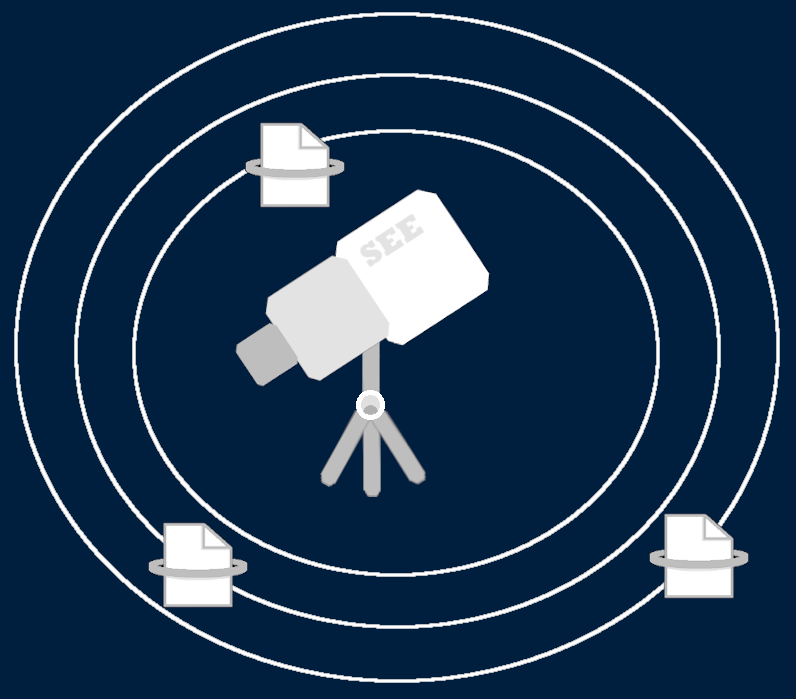

# Security-Events-Explorer

### A user-friendly and powerful tool to analyze Windows Security Events

SEE (Security Event Explorer) is an attempt to create a log intelligence tool which is both user-friendly and powerful.

Indeed, both during the monitoring activity of a security analyst and during Incident Response processes, we need reliable
and fast tools to explore logs. One of the best places to look for potential indicators of comprimise is the Windows Event viewer, and Windows Security
Events can allow to discover malicious activities such as lateral movement, privilege escalation and many others. However, Windows Event Viewer, although powerful,
is not user friendly, and making searches on it is complex and time-consuming. For this reason, I started the deployment of an open-source tool
which will be at disposal of cyber security analysts to quickly and better analyze security events happening in their network.

Currently, the tool is under active development, but the basics feature are already present.
The tool allows the analysis of Windows Security Events. You will need to export Security Events in **xml** format from the Windows Event Viewer
to start. Then, you can load it on the webapp (note that *logs will stay on your browser and won't be sent to the server!*), select which kind of events you are interested in,
apply filtering on time and on events (using the Orchestrator, but this is under development!) and then draw a clear timeline of the events. Finally, you will be able to
export the report in PDF format to provide evidence of your monitoring activity and detections.

## Download and Run ...

Clone the Repo:

`git clone https://github.com/Balzu/Security-Events-Explorer.git`

Enter the folder:

`cd Security-Events-Explorer`

Run the tool in two distinct containers using Docker:

`docker-compose up`

When you are done, turn off the tool:

`docker-compose down`

## ... Or try it Online!

The web-app is currently loaded on https://securityeventsexplorer.com

### Demo

